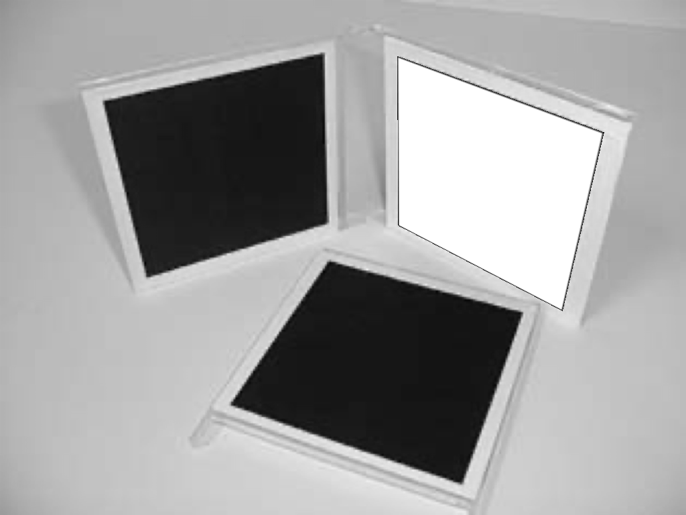
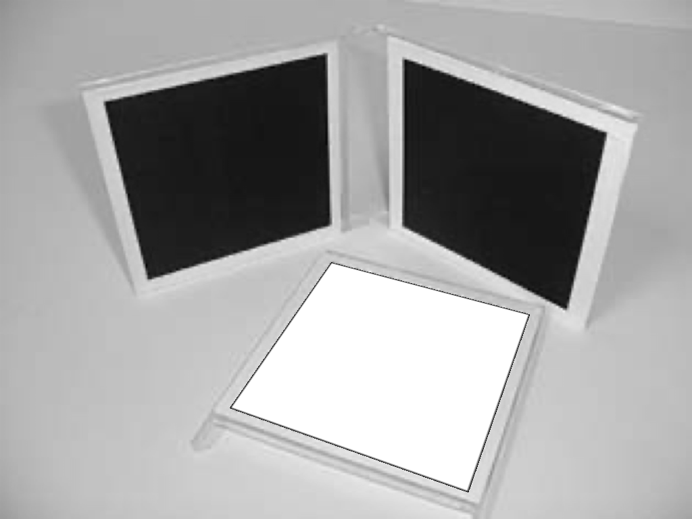

# Single-view Reconstruction

## 1. Camera matrix `P` from 2D-3D correspondences

------

Our goal is to compute `P` from 2D-3D point correspondences.

### (a) Stanford Bunny
We use a picture of Stanford bunny `data/pose_estimation/bunny.jpeg` and 2D-3D point correspondences in `data/pose_estimation/bunny.txt`. The text 
file contains multiple rows. Each row represents a pair of 2D-3D correspondences, where the first 2 numbers are the 2D coordinates on the image while the next 3 numbers are the corresponding 3D coordinates.

#### Visualizing annotations

  | Input Image                                             | Annotated 2D points                                         |
|---------------------------------------------------------|-------------------------------------------------------------|
  |  |  | 

#### Run

`python main.py --type pose_estimation --subject bunny --task project_points`
`python main.py --type pose_estimation --subject bunny --task draw_bbox`

#### Camera matrix `P`

    P = [[ 6.12468612e-01 -2.80769806e-01  1.09185025e-01  2.12092927e-01],  
    [-8.90197009e-02 -6.43243106e-01  1.93261536e-01  1.73520830e-01],  
    [ 5.51654830e-05 -1.35588807e-04 -7.00171505e-05  9.52266452e-05]]

#### Visualizing projected points and bounding box

  | Surface Points                      | Bounding Box                          |
|-------------------------------------|---------------------------------------| 
  |  |  | 

### (b) Cuboid
Now we capture an image of a cuboid and come up with our 3D coordinate system (by measuring the relative dimensions of the cuboid) and annotate 6 
pairs of point correspondences. We then compute the camera matrix `P` using the annotated 2D-3D correspondences.

#### Run

`python main.py --type pose_estimation --subject cuboid`

#### Camera Matrix `P`

    P = [[ 1.98148496e-01 -3.94709420e-01 -1.00587176e-01 -4.40300684e-01], 
    [ 4.81158687e-02  2.88305349e-02 -4.25380885e-01 -6.45649926e-01],  
    [-7.47179573e-05 -6.81219120e-05 -6.67792494e-05 -3.15268178e-04]]

#### Visualizing annotations and bounding box

  | Input Image                                           | Annotated 2D points | Bounding Box                             |
|-------------------------------------------------------| ----------- |----------------------------------------|
  |  |  |   |

## 2. Camera calibration from annotations

------

### (a) Camera calibration from vanishing points
Here our goal is to compute the camera intrinsic `K` from a triad of orthogonal vanishing points, assuming that the camera has zero skew and that the 
pixels are square. We annotate 3 pairs of parallel lines that are orthogonal to each other.

#### Visualization of the annotations and vanishing points
  
  | Input Image                                                  | Annotated Parallel Lines                                                      | Vanishing points  and principal point           |
|--------------------------------------------------------------|-------------------------------------------------------------------------------|--------------------------------------------------------|
  |    |  |  |

#### Run

`python main.py --type camera_calibration --task from_van_points`

#### Computed `K` for the input image.

    K = [[1.15417802e+03 0.00000000e+00 5.75066005e+02], 
    [0.00000000e+00 1.15417802e+03 4.31939090e+02],  
    [0.00000000e+00 0.00000000e+00 1.00000000e+00]]

#### Implementation

1. Annotate 3 pairs of parallel lines. All pairs should be mutually orthogonal.
2. Find the corresponding vanishing points from the intersection of lines.
3. Each pair of vanishing points $(v1, v2)$,  yields a constraint $v_1^T \omega v_2 = 0$. We can now construct a system of linear equations  
   for $Ax = 0$ and solve for $\omega$ using SVD. Note that we only need 3 constraints because we assume zero skew and square pixels.
4. We use Cholesky decomposition to find $K$ which is related to $\omega$ by $\omega = K^{-T} K^{-1} $. 

### (b) Camera calibration from metric planes

Here our goal is to compute `K` from the image of three squares. We will not make any additional assumption on `K` (except that it 
is a projective camera).

#### Visualizing annotations
  
  | Input Image                                                 | Annotated Square 1                                            | Annotated Square 2                                            | Annotated Square 3                                            | 
|-------------------------------------------------------------|---------------------------------------------------------------|---------------------------------------------------------------|---------------------------------------------------------------|
  |  |  |  |  |
    
#### Run

`python main.py --type camera_calibration --task from_squares`

 #### Evaluating angles between each pair of planes

  |       | Angle between planes(degree)   |
  |--------------------------------| -----------  |
  | Plane 1 & Plane 2    | 180 - 112.63                   |
  | Plane 1 & Plane 3    | 180 - 92.21                    |
  | Plane 2 & Plane 3    | 180 - 85.26                    |

#### Computed intrinsic matrix `K`

     K = [[ 1.08151577e+03 -8.29602330e+00  5.12926979e+02],  
     [ 0.00000000e+00  1.07685923e+03  3.92317997e+02], 
     [ 0.00000000e+00  0.00000000e+00  1.00000000e+00]]

#### Implementation

1. We assume that we are dealing with objects of a known geometry here i.e. square. The image must contain at least 3 square that lies on 
   mutually non-parallel planes. 
2. We plot the squares in a metrically rectified coordinate system and compute a homography between each metric square and its projection in the 
   image.
4. Each of the 3 homographies give us 2 constraints: $h_1^T \omega h_2$ = 0 and $h_1^T \omega h_1$ = $h_2^T \omega h_2$ where $h_1$ and 
   $h_2$ are the first two columns of the homography. We can now set up a system of linear equations and solve for $\omega$ using SVD.
5. We then use Cholesky decomposition to find $K$ which is related to $\omega$ by $\omega = K^{-T} K^{-1}$. 

## Camera calibration from rectangles with known sizes 
We computed `K` from the image of three squares. Now we will modify the approach by relaxing the assumption of imaging squares, and instead 
computing `K` from the image of three rectangles, each with known height-to-width ratios.

#### Visualizing annotations

  | Input Image                                               | Annotated Rectangle1                                               | Annotated Rectangle2                                                                        | Annotated Rectangle3                                               |
|-----------------------------------------------------------|--------------------------------------------------------------------|---------------------------------------------------------------------------------------------|--------------------------------------------------------------------|
  |  |  |  |  | 
    

#### Run

`python main.py --type camera_calibration --task test_image`
  
#### Evaluating angles between each pair of planes

  |       | Angle between planes(degree) |
  |------------------------------| ----------- |
  | Plane 1 & Plane 2    | 180 - 97.64                  |
  | Plane 1 & Plane 3    | 180 - 103.96  |
  | Plane 2 & Plane 3    | 180 - 91.35    |

#### Computed intrinsic matrix `K`

    K = [[ 6.35118876e+03  1.61704009e+02 -2.36167794e+03],  
    [ 0.00000000e+00  2.22267528e+03 -3.60764782e+02],  
    [ 0.00000000e+00  0.00000000e+00  1.00000000e+00]]$

#### Implementation

1. This follows the same process as that for a square. We must, however, compute/know the ratios between the dimensions of each rectangle.

## 3. Single View Reconstruction

------

Here our goal is to reconstruct a colored point cloud from a single image. We assume zero skew and square pixels for our input image.

#### Run

`python main.py --type reconstruction`

#### Visualizing plane annotations and reconstructions 

  | Input Image                                                          | Annotations| Reconstruction View 1 | Reconstruction View 2                        | Reconstruction View 3  | 
|----------------------------------------------------------------------|-------------------------------------------------------------------------------| ----------- | -------- |------------------------|
  |  |  |   |   |

#### Implementation

1. Annotate the corners or boundaries of multiple planes on the image (e.g. walls, roof). All annotated planes must share at least one boundary 
   the point with another plane.
2. Estimate the camera intrinsic `K` using `camera calibration from vanishing points`
3. Compute $P^+$ using $P (= K [I | 0])$. (We assume a camera coordinate system for reconstruction)
4. Repeat the following for every annotated plane
   1. Find the plane normal $n$ from the vanishing points of the plane. Direction of ray through a point  is given as $d_i = K^{-1} v_i$. The plane 
       normal $n$ can then defined using two rays passing through two vanishing points as $n = d_1 \times d_2$.
   2. Find a reference point at a fixed depth. 
      1. For the first plane (index 0) we arbitrarily define a reference depth for one of the boundary points $u$. This is done by finding the 
         intersection of the line passing through the origin in the direction $d = P^+ u$ with the plane $z = 10$. This gives a fixed 3D point $X_{ref}$
      2. For the subsequent frames this point can be retrieved from a cache that stores 3D locations of boundary points. This is possible because 
         annotated planes share at least one boundary point with another plane.
   3. Find the equation of the plane in $P^3$. Since $X_{ref}$ passes through the plane, we can define it as $\pi = [n, r]$ where $r$ is the residual
      such that $n^T X_{ref} + r = 0$.
   4. Find the 3D location of all points on this plane by finding their ray direction $d_i = P^+ u_i$, plucker representation $L_i$ (using origin and 
      point 
      at infinity) and finally the intersection with the plane which is given as $X_i = L_i \pi$.
   5. Cache the 3D locations of the boundary points.
